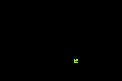

# orbits
An exercise for learning about header files in C++. See instructions [here](./instructions.md)

UPDATE

This game has been refactored with h files, new cpp files, and include guards. Additional updates to sprite design, and positioning to the orbiter sprites.

Here is a link to the GitHub Pages for testing:
